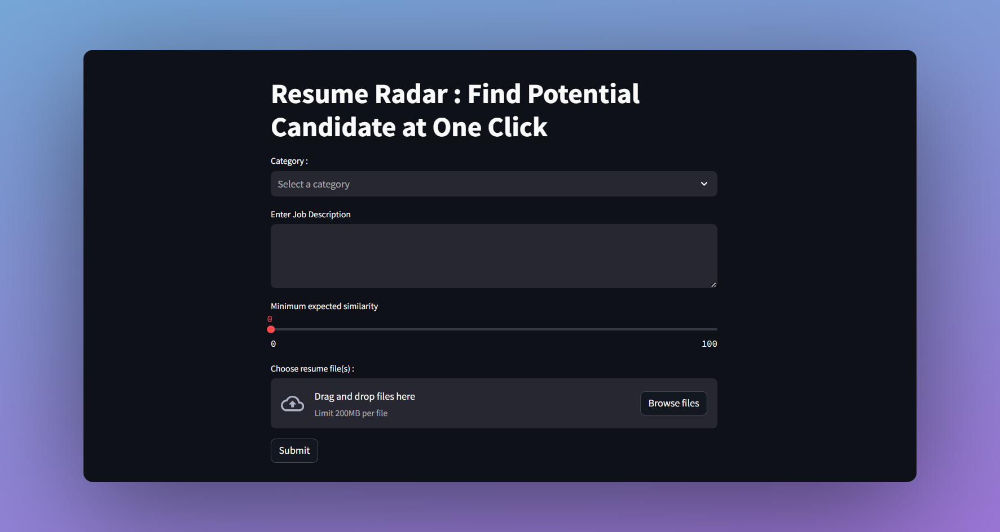

# Resume Radar 
  

Resume Radar is a user-friendly web application designed to streamline candidate selection processes. With just a job category, description, expected similarity, and a list of PDFs, Resume Radar utilizes BERT transformer technology to accurately filter resumes based on job categories, achieving 79% accuracy rate. To ensure top matching resumes based on specified similarity thresholds is delivered, the system utilizes TFIDF to vectorize both job description and resumes and assess cosine similarity between job descriptions and candidate profiles. Resume Radar optimizes recruitment outcomes for hiring professionals by ensuring efficient and precise candidate selection.  

Dataset used : https://www.kaggle.com/datasets/snehaanbhawal/resume-dataset 

## How It Works ? 
1) Users input job category, description, minimum similarity, and PDF resumes.
2) Resumes are filtered using BERT transformer based on job category. For instance, if we set Job Category as HR, any resumes in the list that is not of HR category will be removed. This is essential especially in large scale resume screening process. 
3) Textual data is vectorized for resumes and job description using TFIDF.
4) Cosine similarity is calculated between each resume and job description.
5) Top matching resumes exceeding the minimum similarity are retrieved. 
6) Matched resumes are presented for further review and consideration.


## Demo video 
[Click here for demo video](resume-screener.MP4) 

Live demo : https://resume-radar.streamlit.app/ 

## Resources in Demo video

1) Description : 
- https://www.indeed.com/employers/job-description/human-resources-manager
- https://www.indeed.com/employers/job-description/accountant 

2) Resume (Already available in the "Unseen-Resume-Streamlit" folder) : 
- https://resumeworded.com/human-resources-resume-examples#human-resources-manager
- https://resumeworded.com/graphic-designer-resume-examples
- https://resumeworded.com/accountant-resume-examples 


## Run Locally 

1) Clone the project 

```bash
  git clone https://github.com/ShaaiRao03/resume-screener- 
```

2) Install Requirements from a Requirements File

Note : Use requirements-2.txt . requirements.txt is used for Streamlit application. 
```bash
  pip install -r requirements-2.txt 
```

3) Install Streamlit 

```bash
  pip install streamlit
```

4) Run the following command 

```bash
streamlit run app.py
```

5) Access the web through the link provided in the terminal 

Note : If you want to retrain the model by running the resume-bert-model.ipynb , please run on GPU as it will take shorter time compared to running on your computer's CPU. In my case, I had no option other than running on CPU, therefore, it took me 29 hours to complete the training process.  

## Issues

If you face any issues such as the link is not working and so on, please notify me via shaairao03@gmail.com .

Possible issue : https://discuss.streamlit.io/t/error-running-app-failed-to-download-the-sources-for-repository/49709 
